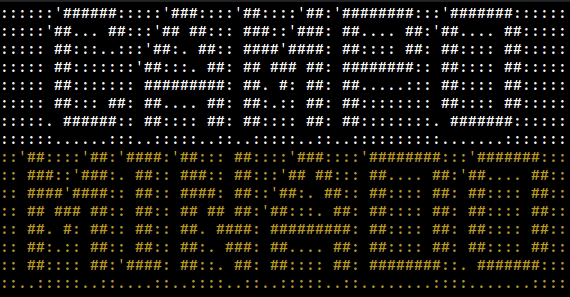
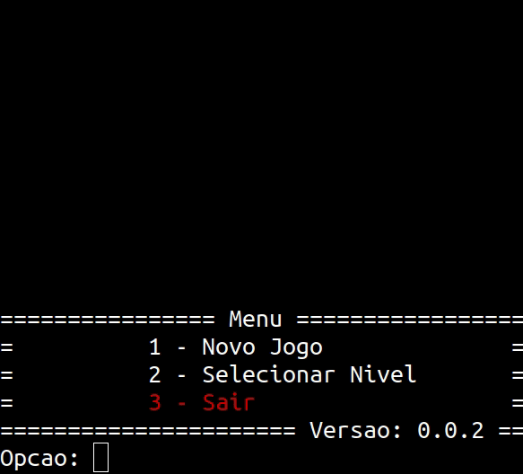
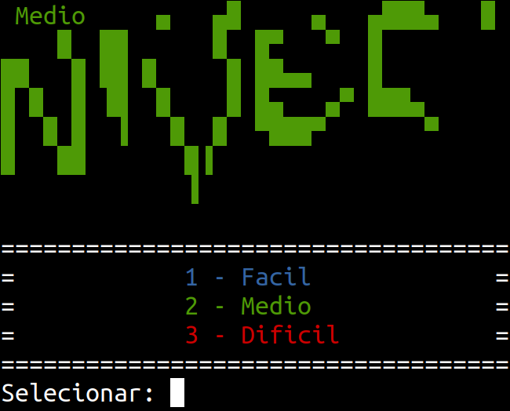
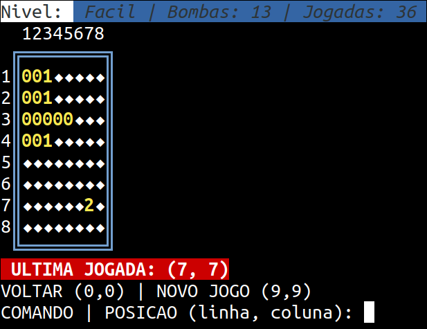
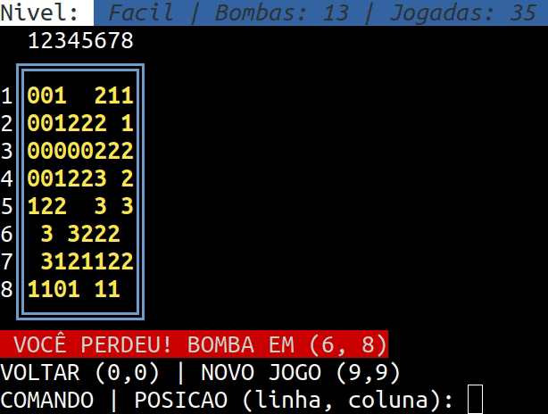

## Campo Minado

Implementação do jogo campo minado em C.

## Screenshot

    
    
    
    
    
    

## Considerações

O Jogo utilizar alguns recurso especificos do UNIX, comandos: sleep e clear.